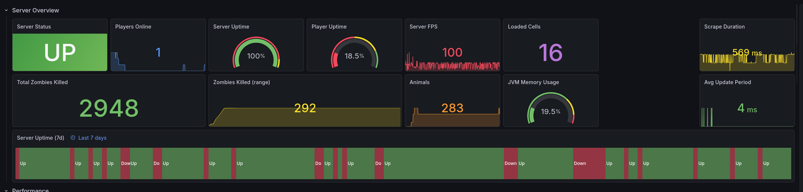
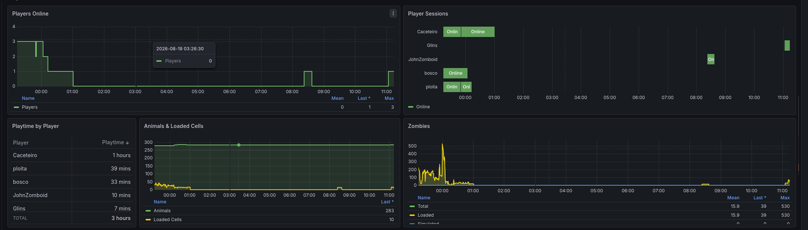

# pzmonitor

[](https://github.com/MarioMoura/pzmonitor/actions/workflows/ci.yml)
[](https://github.com/MarioMoura/pzmonitor/releases)
[](LICENSE)

A Prometheus exporter for Project Zomboid dedicated servers. Collects server metrics via RCON and exposes them on a `/metrics` endpoint.





A ready-to-import Grafana dashboard is included at [`grafana/dashboard.json`](grafana/dashboard.json).

## Metrics

- **Server health**: FPS, JVM memory (used/total/max), average update period
- **Players & world**: players online, zombies (loaded/simulated/total), loaded cells, animal instances
- **Daily events**: zombies killed, players killed (by zombie/player/fire), zombified players, burned corpses
- **Network**: bytes sent/received per second, packet loss
- **Operational**: scrape duration, server up/down

## Installation

Download the binary for your platform from the [Releases](https://github.com/MarioMoura/pzmonitor/releases) page, then:

```bash
chmod +x pzmonitor
./pzmonitor
```

Or build from source:

```bash
go install github.com/MarioMoura/pzmonitor@latest
```

## Configuration

All configuration is done via environment variables:

| Variable | Default | Description |
|---|---|---|
| `PZMONITOR_RCON_HOST` | `127.0.0.1` | RCON server host |
| `PZMONITOR_RCON_PORT` | `27015` | RCON server port |
| `PZMONITOR_RCON_PASSWORD` | *(required)* | RCON password |
| `PZMONITOR_LISTEN_ADDR` | `:9101` | Address for the HTTP metrics server |
| `PZMONITOR_LOG_LEVEL` | `info` | Log level (`debug`, `info`, `warn`, `error`) |

Copy `.env.example` as a reference:

```bash
cp .env.example .env
```

## Prometheus

Add a scrape job to your `prometheus.yml`:

```yaml
scrape_configs:
  - job_name: pzmonitor
    static_configs:
      - targets: ["localhost:9101"]
```

## Endpoints

- `GET /metrics` - Prometheus metrics
- `GET /healthz` - Health check
